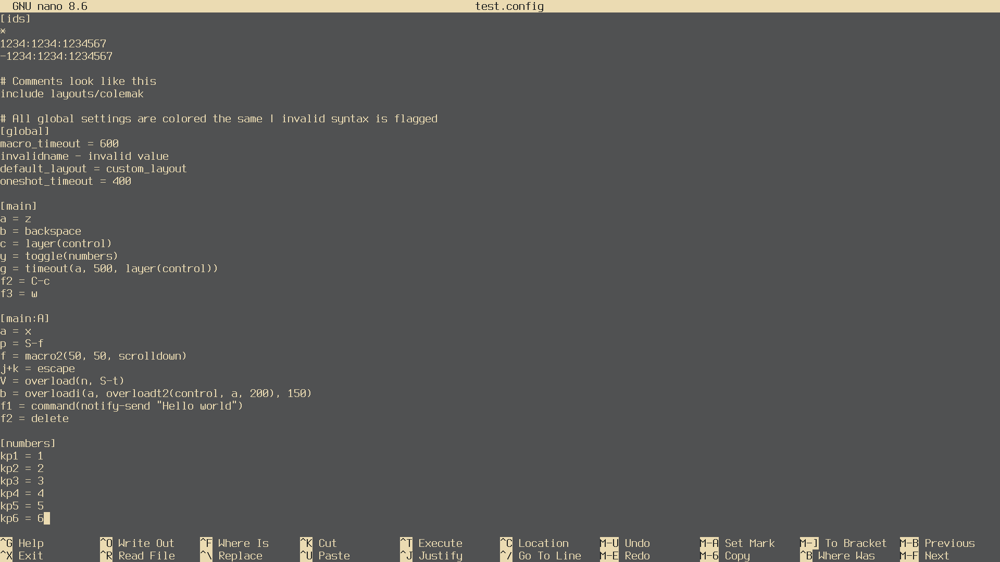
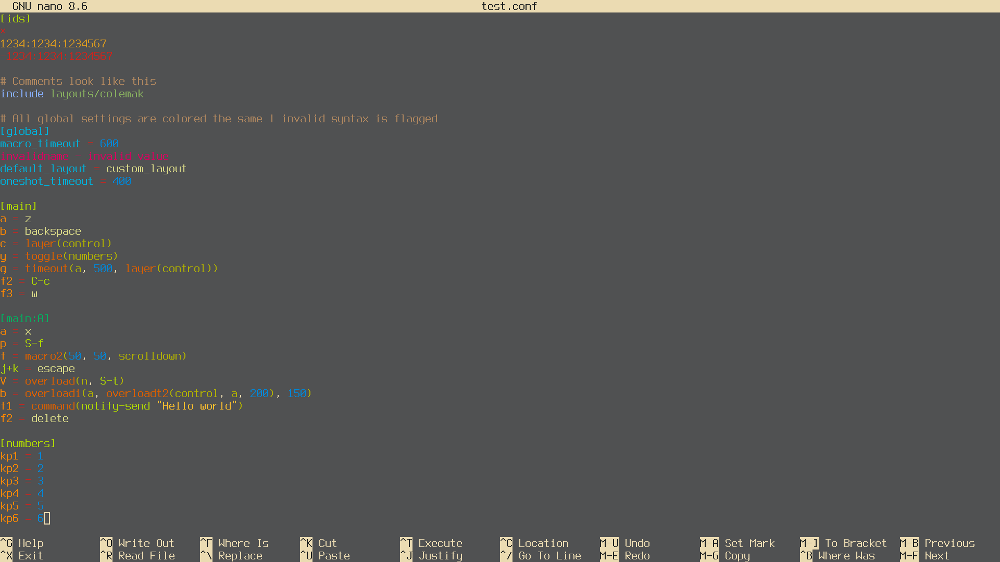

# GNU Nano Syntax Highlighting for Keyd Configuration Files

----------

This repository provides a comprehensive syntax highlighting file for GNU Nano,
designed primarily for configuration files of the Keyd remapping daemon.
The rules can also be useful for other configuration files with an '.ini'- or
'.conf'-like structure. Some rules for '.ini' and '.conf' files are already 
active in the syntax file. Lines that could conflict with Keyd-specific highlighting
are commented out by default. Instructions for enabling or adjusting these rules are
included directly in the file as comments, allowing you to safely adapt the higlighting
for other configuration files while keeping Keyd highlighting rules intact.

----------

## 🖥️  *How does it look?*
| Highlighting disabled | Highlighting enabled
| :-------------: | :--------------: |
|   |   |

----------

## 🎨 *What does each color represent?*
### Highlighting of global options and device lists
-  Latte: Comments;
-  Sky: `include` directives;
-  Yellow: Listed device IDs;
-  Sage: Paths and filenames after `include`;
-  Lagoon: The [global] section and its options;
-  Crimson: Invalid syntax;
### Highlighting of functional configuration and remapping rules
-  Orange: Key area (left to the equal sign);
-  Sand: Value area (right to the equal sign)
-  Red: 
    1. The [ids] section wildcard;
    2. Blacklisted devices, e.g. `-1234:1234`;
    3. The assignment operator `=`;
-  Sea: Numeric digits;
-  Ocher: Parentheses and their content;
-  LightYellow: String values;
-  Brick: Functions;
-  Lime: 
    1. Macros and modifiers;
    2. Section headers;
-  Teal: Section headers with modifiers, e.g. `[nav:S]`;

----------

## Optional Highlighting for Extended Config Syntax
In addition to the Keyd-specific syntax, this higlighting file also supports some **optional constructs** that are common in '.ini'
or '.conf' files, but not currently used by Keyd.
These include:

- Numeric values with optional suffixes: 'ms', 's', 'us' (suffixes inherit the color of the preceding number);
-  Lagoon: Floating-point numbers;
-  Beet: Boolean values ('true' / 'false');

These rules are included to make the syntax file more versatile for other configuration files and can safely be ignored
if you are only working with Keyd configs.

----------

## Acknowledgements
- [Keyd](https://github.com/rvaiya/keyd) project by rvaiya.

----------

## License
[MIT](./LICENSE) 
